# Where in the World? 🌍

A geography quiz party game built with Flutter where players guess countries from landmark images.

---

## 📸 Screenshots

<table>
  <tr>
    <td align="center"><b>Launch Screen</b></td>
    <td align="center"><b>Mode Selection</b></td>
    <td align="center"><b>Game Lobby</b></td>
  </tr>
  <tr>
    <td>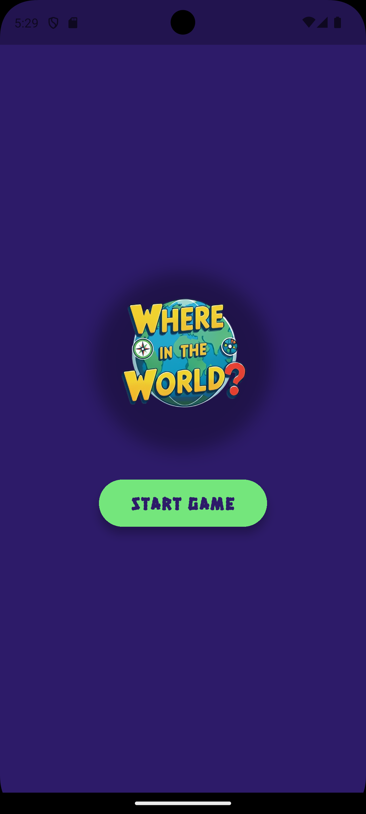</td>
    <td>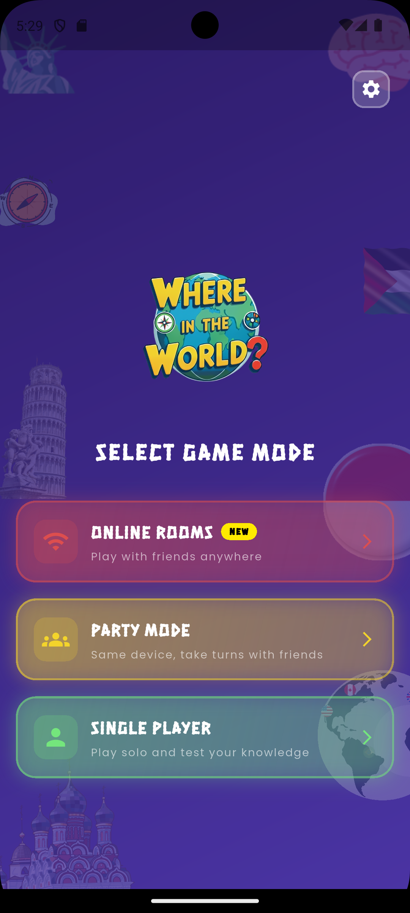</td>
    <td>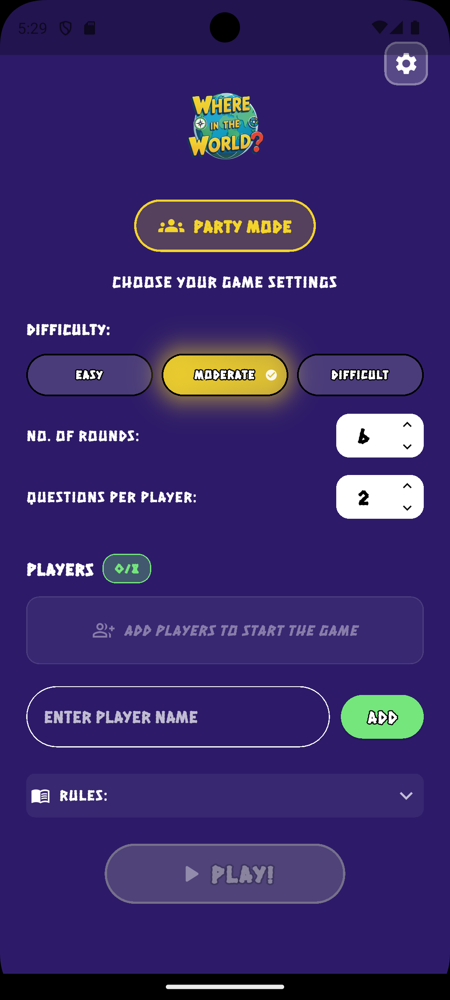</td>
  </tr>
  <tr>
    <td align="center"><b>Main Game</b></td>
    <td align="center"><b>Answer Dialog</b></td>
    <td align="center"><b>Leaderboard</b></td>
  </tr>
  <tr>
    <td>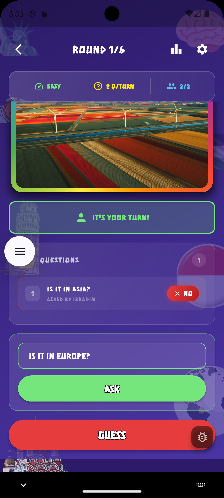</td>
    <td>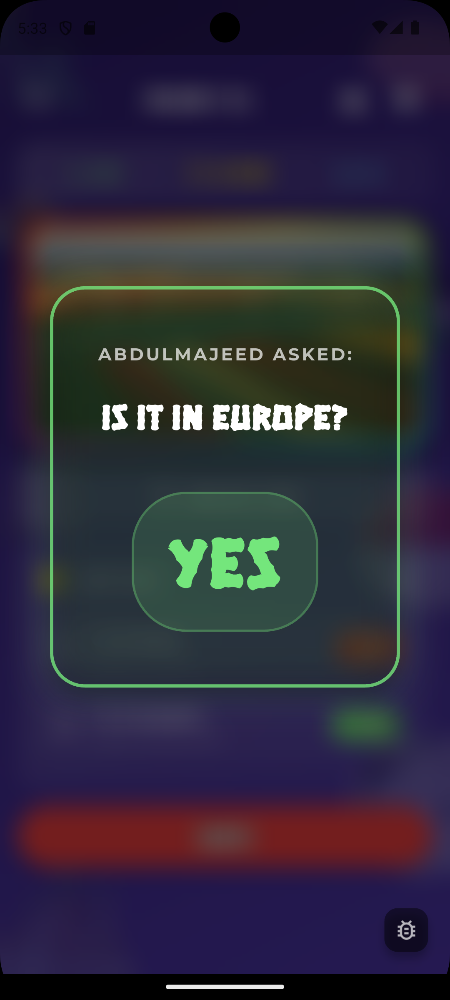</td>
    <td>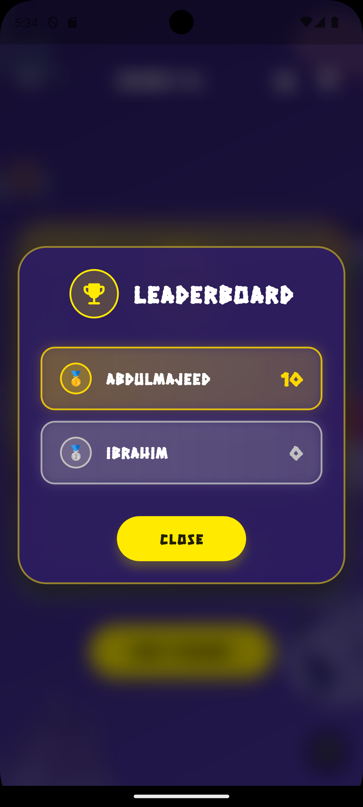</td>
  </tr>
  <tr>
    <td align="center"><b>Online Lobby</b></td>
    <td align="center"><b>Room Creation</b></td>
    <td align="center"><b>Settings</b></td>
  </tr>
  <tr>
    <td>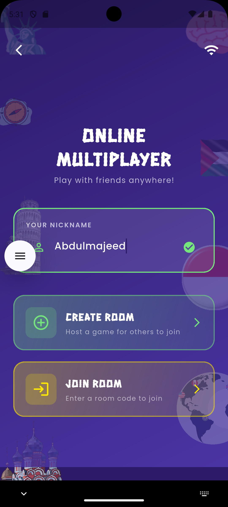</td>
    <td>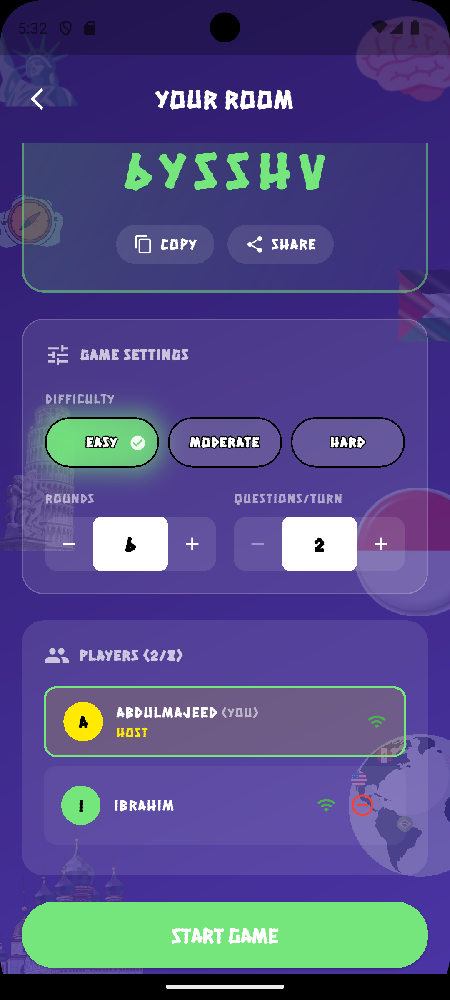</td>
    <td>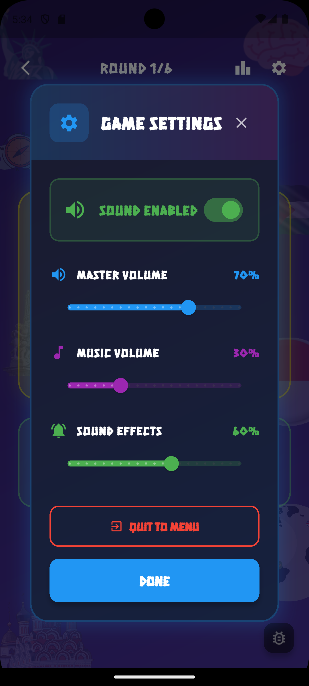</td>
  </tr>
</table>

> 📝 **Note**: Add your screenshots to the `screenshots/` folder with the names shown above.

---

## 🎮 Game Overview

"Where in the World?" is a multiplayer party game where teams compete to identify countries from landmark images. Players take turns asking yes/no questions and making guesses to determine the correct country.

---

## ✨ Features

| Feature | Description |
|---------|-------------|
| 🎭 **Multiple Game Modes** | Single Player, Party Mode, and Online Multiplayer |
| 👥 **Multiplayer Support** | 2-8 players can play together |
| 🎯 **Difficulty Levels** | Easy, Moderate, and Difficult |
| 🎲 **Customizable Rounds** | Set the number of rounds and questions per player |
| 🤖 **AI-Powered Answers** | Uses Google AI (Gemini) to answer yes/no questions |
| 📊 **Real-time Leaderboard** | Track scores throughout the game |
| 📝 **Question History** | View previously asked questions and answers |
| 🎵 **Audio System** | Background music and sound effects |
| 🎨 **Beautiful UI** | Modern glassmorphism design with smooth animations |

---

## 🔄 Application Flow

### Overall Game Flow

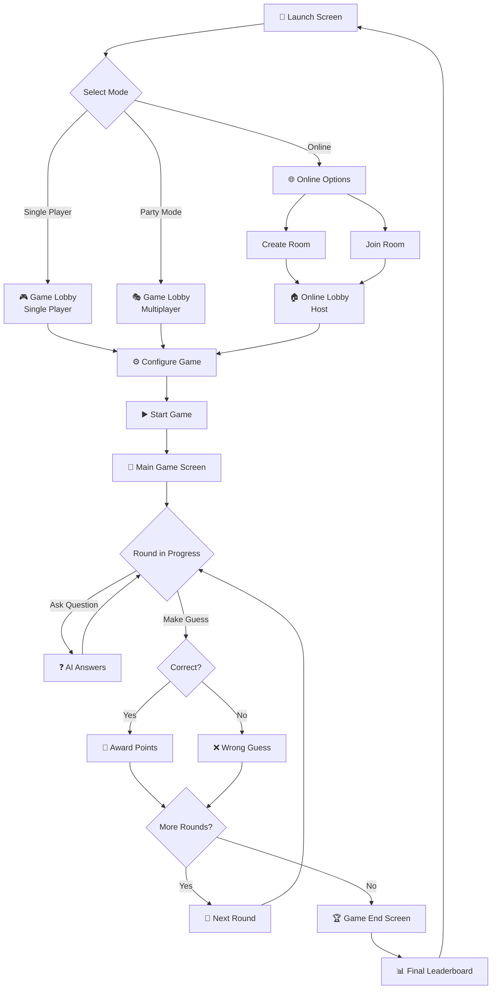

### Turn-Based Gameplay Flow

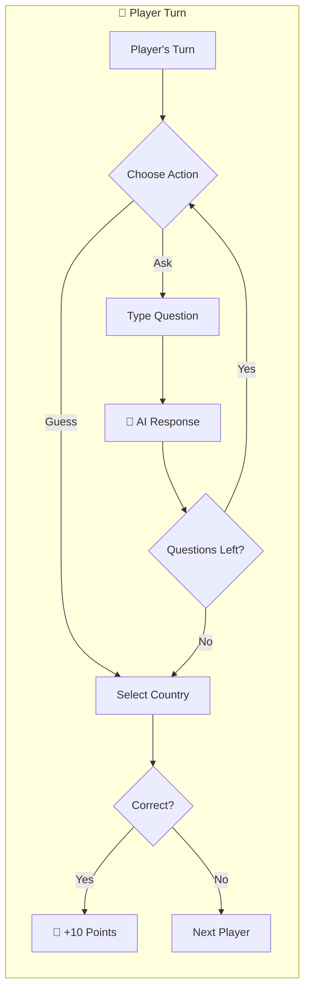

### Online Multiplayer Flow

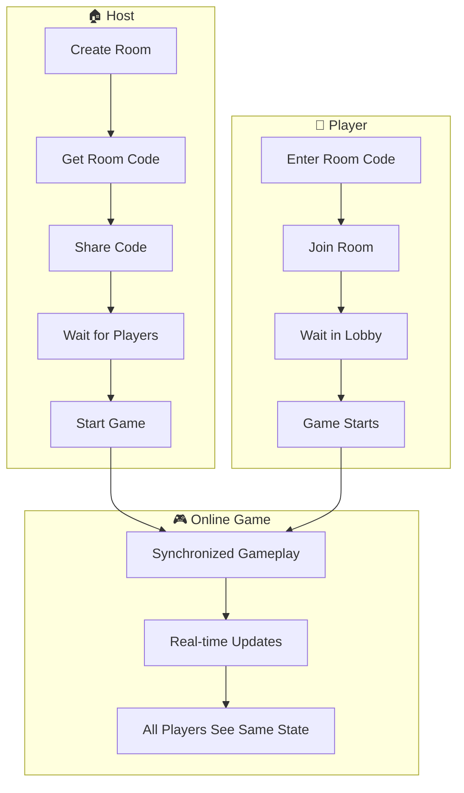

---

## 🎯 Scoring System

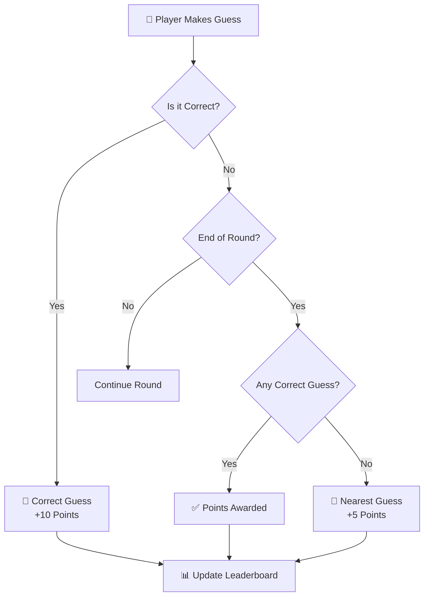

---

## 📱 Screen Navigation

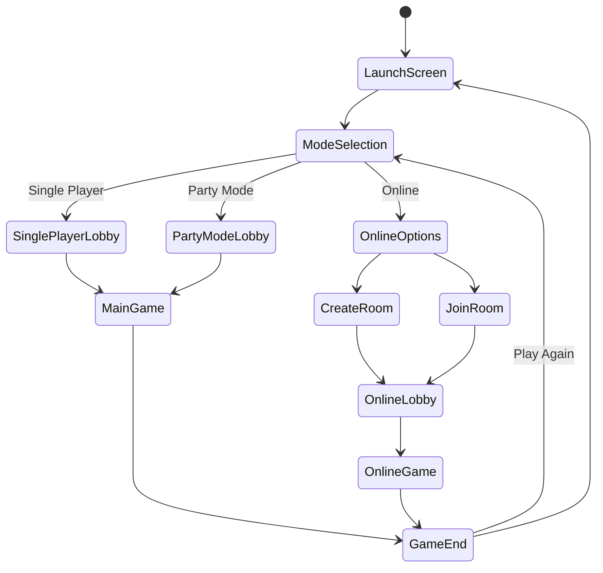

---

## 🎲 How to Play

1. **🚀 Setup**: Choose game mode, difficulty, and number of rounds
2. **👥 Add Players**: Add 2-8 players to the game (or just yourself for single player)
3. **❓ Ask Questions**: Each player can ask up to 2 yes/no questions per round. The AI will answer based on the landmark information.
4. **🌍 Make Guesses**: Players can guess the country at any time
5. **🏆 Scoring**: Correct guesses earn 10 points, nearest guesses earn 5 points
6. **🎉 Win**: The player with the highest score after all rounds wins!

---

## 📜 Game Rules

- 🎯 The player who asked the last question has priority to guess
- ❌ Cancellation of a guess after pressing the guess button is not allowed
- ✅ Players are allowed to directly guess at their turn point in the game
- 🥈 If no player guesses the right country, the player with the nearest guess gets half points

---

## 🚀 Getting Started

### Prerequisites

- Flutter SDK (3.8.1 or higher)
- Dart SDK
- Chrome browser (for web development)

### Installation

1. Clone the repository
2. Navigate to the project directory
3. Install dependencies:
   ```bash
   flutter pub get
   ```

### Google AI API Setup

The game uses Google AI (Gemini) to answer questions about landmarks. You need to set up an API key:

1. **Get a Google AI API Key**:
   - Go to [Google AI Studio](https://makersuite.google.com/app/apikey)
   - Sign in with your Google account
   - Click "Create API Key"
   - Copy your API key

2. **Configure the API Key** (choose one method):

   **Method 1: Environment Variable (Recommended)**
   ```bash
   # Windows PowerShell
   $env:GOOGLE_AI_API_KEY="your-api-key-here"
   
   # Linux/Mac
   export GOOGLE_AI_API_KEY="your-api-key-here"
   ```

   **Method 2: Programmatically**
   ```dart
   // In your app initialization
   context.read<GameProvider>().updateAIApiKey('your-api-key-here');
   ```

   **Method 3: Update config file**
   - Edit `lib/config/api_config.dart` and replace `YOUR_API_KEY_HERE` with your actual API key
   - ⚠️ **Not recommended for production** - this exposes your key in code

### Running the App

For web development:
```bash
flutter run -d chrome
```

For Android:
```bash
flutter run -d android
```

---

## 📁 Project Structure

```
lib/
├── config/          # Configuration (API keys, etc.)
├── data/            # Static data (countries, landmarks)
├── models/          # Data models (Player, Question, Landmark, etc.)
├── providers/       # State management (GameProvider, OnlineGameProvider)
├── screens/         # UI screens
│   ├── launching_screen.dart
│   ├── mode_selection_screen.dart
│   ├── game_lobby_screen.dart
│   ├── main_game_screen.dart
│   ├── online_lobby_screen.dart
│   ├── online_game_screen.dart
│   ├── create_room_screen.dart
│   └── join_room_screen.dart
├── services/        # Services (AI, Audio, Room, Photos)
├── widgets/         # Reusable UI components
├── utils/           # Utility functions (responsive helpers)
└── main.dart        # App entry point

assets/
├── images/          # General app images
├── landmarks/       # Landmark images for the game
├── lotties/         # Lottie animation files
└── sounds/          # Audio files (music & effects)

screenshots/         # App screenshots (for README)
```

---

## 🛠️ Technologies Used

| Technology | Purpose |
|------------|---------|
| **Flutter** | Cross-platform UI framework |
| **Provider** | State management |
| **Firebase** | Backend for online multiplayer |
| **Google AI (Gemini)** | AI-powered question answering |
| **Lottie** | Beautiful animations |
| **Material Design 3** | Modern UI components |

---

## 🗺️ Architecture Diagram

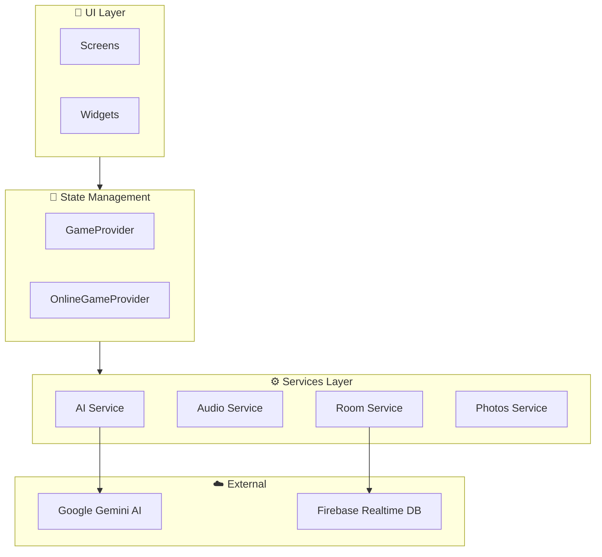

---

## 🚧 Future Enhancements

- [x] ~~Online multiplayer support~~
- [x] ~~Sound effects and music~~
- [ ] More landmark categories
- [ ] Achievement system
- [ ] Custom landmark upload
- [ ] Tournament mode
- [ ] Statistics tracking
- [ ] Localization (multiple languages)

---

## 🤝 Contributing

Feel free to submit issues and enhancement requests!

1. Fork the repository
2. Create your feature branch (`git checkout -b feature/AmazingFeature`)
3. Commit your changes (`git commit -m 'Add some AmazingFeature'`)
4. Push to the branch (`git push origin feature/AmazingFeature`)
5. Open a Pull Request

---

## 📄 License

This project is open source and available under the MIT License.

---

<p align="center">
  Made with ❤️ and Flutter
</p>
